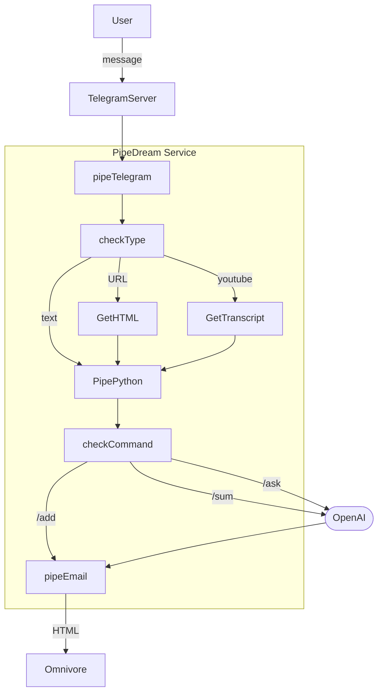

# XBrain

Telegram bot to help you read and summarize the content. It uses [Omnivore](https://Omnivore.app) [or Pocket, Instapaper, Matter] to save the content and [OpenAI](https://openai.com) to summarize it.

## Features

* Message Template: `/command [args: URL or text]`.
* `/add` to add the content to the ReadLater service.
* `/add YoutubeURL` grabes youtube transcript.
* `/sum` to summarize the content.
* `/sum YoutubeURL` get youtube transcript and summarize.
* `/ask` to ask a question from ChatGPT about the content.
* `/token` to add your OpenAI token [ToDo].

## TODO

* [ ] This sends the content to the pipedream user email. Find a way to make it general.

## AppDiagram

Copy the Pipedream diagram for yours: <https://pipedream.com/new?h=tch_3M9fP9>

## Pipedream setup

