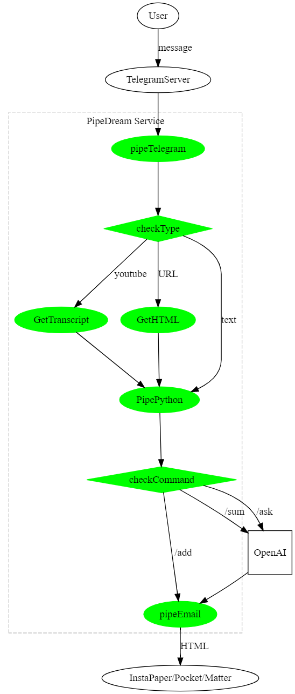

# XBrain

Telegram bot to help you read and summarize content. It uses [Omnivore](https://Omnivore.app) [or Pocket, Instapaper, Matter] to save the content and [OpenAI](https://openai.com) to summarize it.

## Features

* Message Template: `/command [args: URL or text]`
* `/add` to add the content to the ReadLater service
* `/add YoutubeURL` get youtube transcript
* `/sum` to summarize the content
* `/sum YoutubeURL` get youtube transcript and summarize
* `/ask` to ask a question from ChatGPT about the content
* `/thread` to get a twitter thread
* `/token` to add your OpenAI token

## TODO

* [ ] Book Reader!
* [ ] OpenAI Token Getter (Now it check if it is me, it will allow openAI usage)

## Pipedream

## AppDiagram

